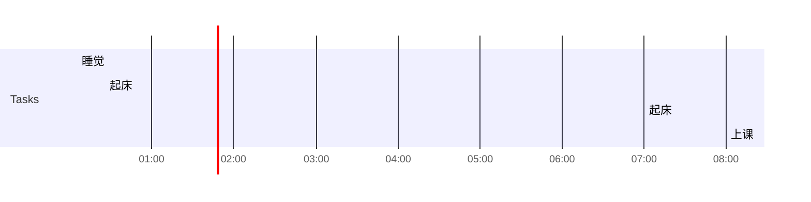

## Day Planner

** 这是2022-06-02的计划 **

### 上午
- [x] 00:05 睡觉
- [x] 00:25 起床
- [x] 07:00 起床
- [x] 08:00 上课

#### 今天遇到的问题
- [x] varchar与char
- [x] SET NOCOUNT ON干嘛的
- [x] int 与 tinyint

### 下午
- [x] 14:00

### 晚上

- [ ] 22:00
- [ ] 