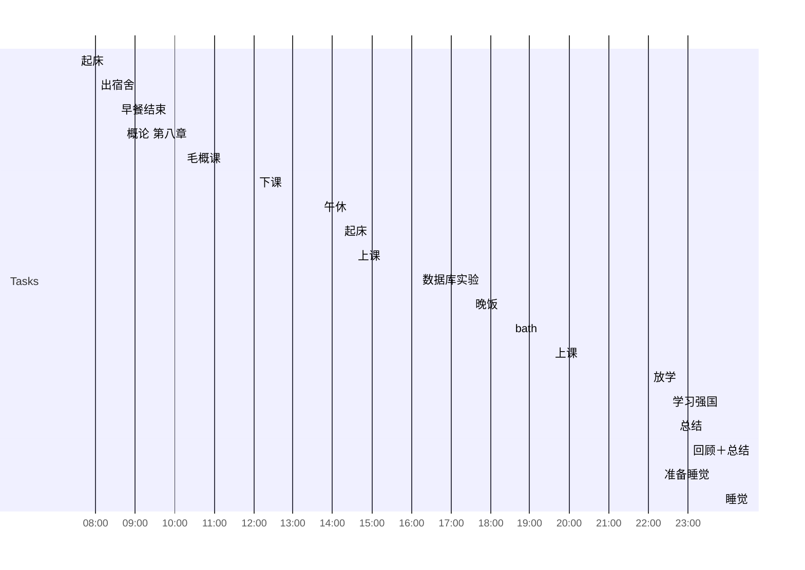

## Day Planner

** 这是2022-06-06计划 **

### 上午
- [x] 07:30 起床
- [x] 08:00 出宿舍
- [x] 08:30 早餐结束
- [x] 08:40 概论 第八章
- [x] 10:10 毛概课
- [x] 12:00 下课

### 下午
- [x] 13:40 午休
- [x] 14:10 起床
- [x] 14:30 上课
- [x] 16:10 数据库实验
- [x] 17:30 晚饭
- [x] 18:30 bath
- [x] 19:30 上课

### 晚上

- [x] 22:00 放学
- [ ] 22:30 学习强国
- [ ] 22:40 总结
- [ ] 23:00 回顾＋总结
- [ ] 23:40 准备睡觉
- [ ] 23:50 睡觉